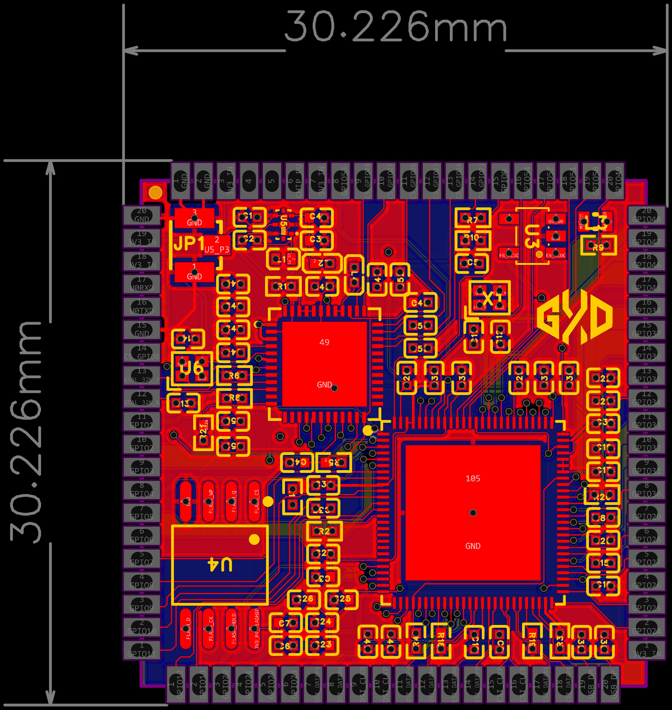

# ESP32-P4C5 核心板（测试版）

基于 **嘉立创EDA专业版** 设计的 ESP32-P4C5 核心板，采用 QFN 封装主控，集成多路独立电源域、射频前端、MIPI 配置与完整去耦网络，面向高性能 IoT / 边缘 AI 应用的模组级硬件平台。



---

## 硬件特性

| 模块 | 说明 |
|------|------|
| **主控** | ESP32-P4（乐鑫高性能 SoC，RISC-V 双核，支持 Wi-Fi 6 + BLE 5.3，QFN 封装） |
| **板型** | 30.226mm × 30.226mm 方形核心板，四边排针引出，便于插接底板或面包板 |
| **电源架构** | 多路独立电源域：1.1V DCDC（主核）、VDDO_PSRAM_1V8、Flash 完整电源、8 路 0Ω 电源隔离 |
| **射频** | 板载射频路径（RF Trace + 匹配网络），预留天线焊盘/连接器 |
| **存储** | 外接 Flash（完整独立电源域）+ PSRAM（1.8V 独立电源域） |
| **高速接口** | MIPI DSI/CSI 配置电阻网络，支持摄像头/显示屏扩展 |
| **时钟** | 双晶振电路（主频 + RTC 低速时钟） |
| **去耦** | 全引脚密集去耦电容阵列，覆盖 VDD、VDD_HP、VDD_SDIO、VDD_SPI 等全部电源域 |

---

## 原理图详解

### 1. 主控电路
- ESP32-P4 以 QFN 封装形式布局，所有 GPIO 按功能分组通过四边排针引出（GPIO0~GPIO28、MIPI、USB、JTAG、SPI、I2C、UART 等）。
- `CHIP_PU` 上拉使能，复位/使能逻辑独立可控。
- Strapping 引脚通过上拉电阻固定启动模式（C5 strapping 上拉区域）。

### 2. 1.1V DCDC 电源
- 独立开关电源为芯片核心提供 1.1V 供电，效率高、纹波低，满足高性能运算时的瞬态电流需求。
- 输出端配置 LC 滤波与多级去耦，抑制开关噪声。

### 3. Flash 完整电源 & PSRAM 电源
- **Flash 电源域**：独立 LDO/开关电源为外部 Flash 供电，与主核电源隔离，避免读写 Flash 时的电源噪声耦合回主控。
- **VDDO_PSRAM_1V8**：PSRAM 接口以 1.8V 电平运行，独立电源域保证高速数据总线信号完整性。

### 4. 8 路 0Ω 电源隔离
- 通过 8 组 0Ω 电阻将不同电源域（VDD、VDD_HP、VDD_SDIO、VDD_SPI、VDD_ANA 等）在 PCB 上物理隔离。
- 调试阶段可断开某路 0Ω 电阻，快速定位电源短路或噪声来源；量产时保留 0Ω 短接，兼顾灵活性与成本。

### 5. 射频路径
- 从芯片 RF 引脚到天线焊盘/连接器的完整射频走线，包含 π 型匹配网络（电容+电感），优化阻抗匹配至 50Ω。
- 射频走线下方净空无铜，避免寄生电容影响天线效率。

### 6. MIPI 配置电阻
- MIPI DSI（显示）与 MIPI CSI（摄像头）接口的配置电阻网络，用于端接匹配与偏置设定，保证高速差分信号完整性。
- 两组 MIPI 配置电阻分别位于原理图右上与左下，对应不同通道。

### 7. 晶振电路
- **高速晶振**：为芯片主频提供稳定时钟源，配合负载电容精确校准频率。
- **低速晶振（RTC）**：为 RTC 与低功耗模式提供 32.768kHz 时钟，支持定时唤醒与低功耗计时。

### 8. 去耦电容阵列
- 全电源域密集排布去耦电容（100nF / 1μF / 10μF 多级组合），覆盖 VDD、VDD_HP、VDD_SDIO、VDD_SPI、VDD_ANA、VDD_LP 等全部供电引脚。
- 电容就近放置在芯片电源引脚与地之间，最小化寄生电感，抑制高频噪声与电源瞬变。

---

## PCB 设计要点

- **尺寸**：30.226mm × 30.226mm 标准方形核心板，四边 2.54mm 排针，可直接插入面包板或焊接到底板。
- **层数**：双层板，红色阻焊，顶层信号 + 底层大面积 GND 覆铜。
- **电源分割**：不同电源域通过 0Ω 电阻隔离，底层 GND 保持完整，避免地环路。
- **射频区**：天线焊盘周围净空无铜，射频走线尽量短直，50Ω 阻抗控制。
- **高速信号**：MIPI 差分对等长等距走线，避免直角弯折，保证高速信号完整性。
- **散热**：主控芯片底部 GND 焊盘通过过孔阵列连接底层大面积覆铜，提升散热能力。
- **丝印**：四边排针标注 GPIO 编号与功能，便于快速接线与调试。

---

## 使用说明

1. **开发环境**：ESP-IDF（推荐）/ PlatformIO / Arduino（第三方支持）。
2. **供电**：通过底板或排针提供 3.3V 系统电源，核心板内部完成 1.1V/1.8V 等电压转换。
3. **下载固件**：通过 JTAG 或 UART 接口连接调试器，使用 ESP-IDF 的 `idf.py flash` 或 OpenOCD 烧录。
4. **射频测试**：焊接天线或连接射频测试线缆，使用频谱仪/网络分析仪验证匹配与发射性能。
5. **MIPI 扩展**：通过底板转接 MIPI DSI 显示屏或 MIPI CSI 摄像头，运行 ESP-IDF 的 LCD/Camera 示例验证。

---

## 文件清单

```
原理图.png                                          # 完整原理图截图
PCB图.png                                           # PCB 顶层/底层渲染图
ESP32-P4C5-核心板-测试版本（嘉立创EDA专业版）.epro2   # 嘉立创EDA专业版源工程
```

---

## 设计工具

- **原理图 / PCB**：嘉立创EDA专业版（`.epro2`）
- **版本**：测试版本（V0.1）

---

## License

MIT License — 开源硬件，欢迎二次设计与改进。
